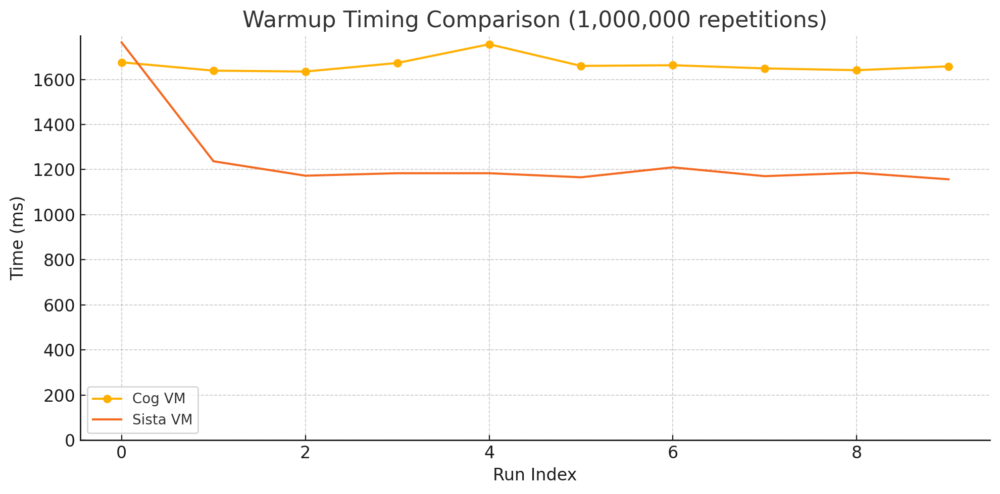
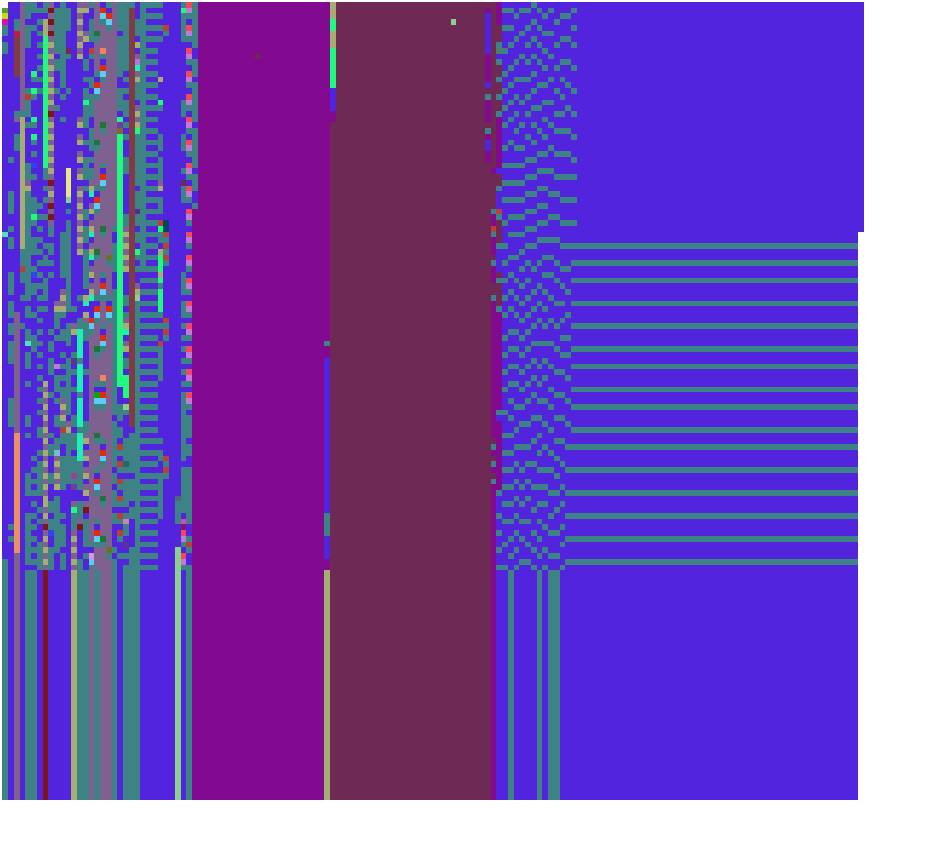

# OOPSIE: Object-Oriented PointerS Interaction Engine for the OpenSmalltalk-VM Simulator

> Malicious tongues claim it stands for *Object-Oriented PointerS Inspection Engine* or even *Object-Oriented Pointers inSpection engInE* instead.

OOPSIE is a proxy framework for the [OpenSmalltalk-VM](https://github.com/OpenSmalltalk/opensmalltalk-vm) [simulator](https://dl.acm.org/doi/10.1145/3281287.3281295), designed to facilitate the bootstrapping of [Scorch](https://github.com/clementbera/Scorch)/Sista and for interactive exploration and debugging of pointers from a simulated image.

This project was initially developed in the context of a Master's Project @ [hpi-swa-teaching](https://github.com/hpi-swa-teaching) in summer 2025. Many thanks to Marcel Taeumel ([@marceltaeumel](https://github.com/marceltaeumel)) and Eliot Miranda ([@eliotmiranda](https://github.com/eliotmiranda)) for their diligent support and guidance throughout the project!

## Installation

1. Clone the OSVM repo and follow the instructions in their readme to build a VMMaker image and a spurreader image
2. Install dependencies:
   - https://github.com/LinqLover/SimulationStudio (required)
   - Peer dependencies *(optional)*:
		- Our fork of Scorch (see below) *(optional, but highly recommended)*
		- https://github.com/LinqLover/yaros/ (install with `load: #js`)
		- https://github.com/LeonMatthes/Autocompletion
	
	  If you choose not to load any of the peer dependencies, in step 4, you can ignore the warnings about missing classes.
3. Install [git-s](https://github.com/hpi-swa/git-s) *(at the time of writing, we recommend the `main` branch instead of `latest-release`)*
4. In Git-S, clone and check out this repository

For Scorch, clone [our fork](https://github.com/MariusDoe/Scorch/tree/squeak) and check out the `squeak` branch via Git-S.  
You can **ignore** all dependcy warnings on missing classes but comment out the reference to `SOValidator` instead after loading.

For colored byte codes in inspectors, you can also load all patches for **instruction printing** referenced in [UPSTREAM.md](./UPSTREAM.md).

## Usage

### Inspection

Start a Sista/Cog VM in the simulator through the Simulation Workspace. Once it is running, send it a do-it like one of these:

```smalltalk
World firstSubmorph tryPrimitive: 114 withArgs: #()!
(Integer>>#benchFib) tryPrimitive: 114 withArgs: #()!
thisContext tryPrimitive: 114 withArgs: #()!
```

In the resulting debugger, do this:

```smalltalk
self inspectOop: self stackTop.
```

Or for the `Context`, even (experimental, currently read-only!):

```smalltalk
(self proxyForOop: self stackTop) oopsieUnsimulatedPerform: #debug.
```

And enjoy the freedom of interacting with the simulated object via inspector fields, do-its, nested inspectors/explorers, and more!

|Inspector on a proxy to a `CompiledMethod`, showing all bytecodes and their `sendAndBranchData`.|Debugger on a proxy to a `Context`.|
|-|-|
|||

**[I want to see more screenshots!](./screenshots/)**

Alternatively, you can use the *inspect oop...* item from the simulator menu and paste the OOP you want to inspect.

### Running Scorch

Start a Sista VM in the simulator like this:

```smalltalk
| cos |
cos := CogVMSimulator newWithOptions:
	#(Cogit SistaCogit
	SistaVM true
	ObjectMemory Spur64BitCoMemoryManager
	MULTIPLEBYTECODESETS true
	bytecodeTableInitializer initializeBytecodeTableForSqueakV3PlusClosuresSistaV1Hybrid
	ISA X64
	sistaSimulatedSelectorCounterTripped conditionalBranchCounterTrippedOn:
	sistaSimulatedSelectorTrap trapTrippedFromSimulation).
cos desiredNumStackPages: 8.

SoDependencyMap cleanUp. "workaround for identity-full proxies"

cos openOn: 'spurreader-64'.
cos openAsMorph.
[cos run] forkAt: 20
```

When the VM is up, send it a do-it like the following:

```smalltalk
30 benchFib!
```

And step through the breakpoints and cross fingers that it works!

Of course, you may test more complex code, like JSON parsing (`[JsonTests suite debug] benchFor: 0.5 seconds`), but at the current time, you will quickly run into open bugs of Sista/Scorch <sub><sup>(or of our context proxy)</sup></sub>. However, with Oopsie, you will find it easier to debug and fix them than ever before!

If you load the [AWFY benchmark suite](https://github.com/smarr/are-we-fast-yet/tree/master/benchmarks/Smalltalk) into the reader image, you can also try to run them like this:

```smalltalk
Json new benchmark!
```

(Notably, also this example does not yet work always, see [road ahead](#road-ahead). To make the counters trip at just the right moment and avoid running into any not-yet-implemented deopts, you can place your spurreader image/changes/sources in `/tmp/mp` (yes, this is indeed a quasi-chaotic system because Squeak's startup routines compare the segments of the cwd path)).

### Running Benchmarks

Build the production VM for Sista via the Source Generation Workspace and `mvm`. Prepare an image (e.g., the spurreader image) by loading Scorch and the [AWFY benchmark suite](https://github.com/smarr/are-we-fast-yet/tree/master/benchmarks/Smalltalk) into it, run it in the production VM, and then run your benchmarks like this:

```smalltalk
[100000 timesRepeat: [(JsonParser with: '"Carpe Squeak"') read; readStringInternal]] timeToRunWithoutGC!
```

See also `Scorch class>>#exampleBenchmark` for comparing the benchmark results of Cog and Sista via OSProcess:



## Road Ahead

With the Oopsie proxy framework, we have made it possible to test, debug, and develop Sista/Scorch effectively by running it the simulator. Sista/Scorch themselves are still in an early stage, contain an unknown number of bugs, and have the potential for plenty more optimizations and unsafe bytecodes. We have documented the open todos of Oopsie in `VMObjectProxy3 class>>#todo`. Notably, Sista traps (for Scorch deoptimization) are not yet supported in simulation as explained in this comment.

## Upstream Changes

This repository also contains a number of rather unrelated changes to the OpenSmalltalk-VM simulator, such as a faster transcript and syntax highlighting for disassembled JIT code. On the other hand, we already contributed back some of our changes to the upstream repositories, many of which are still pending review. You can find a full overview of all of them in [UPSTREAM.md](./UPSTREAM.md).

## Bonus: Using Oopsie To Visualize and Explore the Object Memory

Do it in the simulator:

```smalltalk
self systemNavigation tryPrimitive: 114 withArgs: #()!
```

In the resulting debugger, do `self inspectOop: self stackTop`, then on the proxy:

```smalltalk
| colorTable colors form container |
sample := self allObjects first: 10000.

Random seed: 123.
colorTable := Dictionary new.
colors := Array new: sample size.
1 to: sample size do: [:index |
	colors at: index put:
		(colorTable
			at: ((sample at: index) ifNotNil: [:x | x vmObjectClass])
			ifAbsentPut: [Color random])].
container := Morph new extent: sample size sqrt ceiling asInteger asPoint.
colors withIndexDo: [:color :index |
	container addMorph:
		(Morph new
			position: (index // container width) @ (index \\ container width);
			color: color;
			setProperty: #theObject toValue: (sample at: index);
			on: #mouseDown send: #value to: [ToolSet inspect: (sample at: index)];
			balloonText: ((sample at: index) ifNotNil: [:x | x vmObjectClass]) printString;
			yourself)].
container openAsMorph.
```

This will give you an interactive visualization of the first 10,000 objects in the object memory and their classes (inspired by <https://github.com/hpi-swa-lab/cloud-squeak/blob/main/mini-squeak/index.md#4-analyze-mini-image-directly>). Click or hover on any pixel to inspect it:



