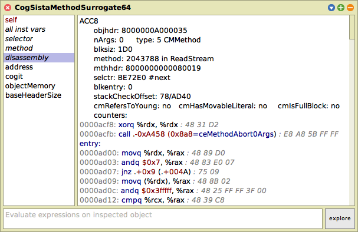
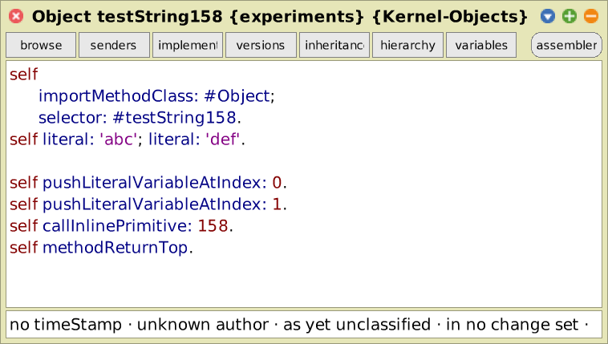
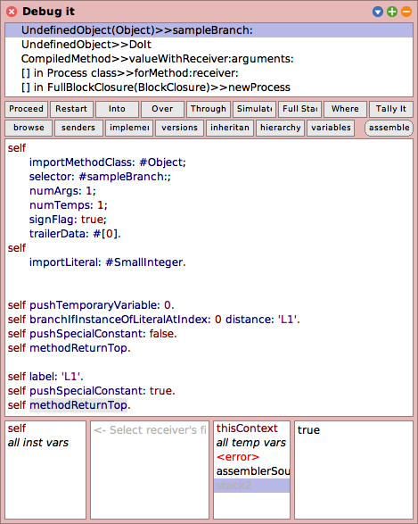

# Screenshots and Screencasts

<table>
  <tr>
    <td width="50%">
      <strong>Inspector on a proxy to a <code>CompiledMethod</code>, showing all bytecodes and their <code>sendAndBranchData</code>.</strong>
    </td>
    <td width="50%">
      <strong>Inspector on a proxy to a <code>Morph</code> from the simulated image, showing a screenshot rendered in the host image.</strong>
    </td>
  </tr>
  <tr>
    <td>
      CompiledMethod</code>, showing all bytecodes and their <code>sendAndBranchData</code>." src="./inspector-method-bytecodes.png">
    </td>
    <td>
      Morph</code> from the simulated image, showing a screenshot rendered in the host image." src="./inspector-morph.png">
    </td>
  </tr>
</table>

This screencast shows how our proxy inspector can be used to inspect a morph from a simulated VM:

<video src="https://github.com/user-attachments/assets/0e337119-23ae-485f-9135-800728d574bb" controls alt="inspector-on-morph-proxy.mp4">https://github.com/user-attachments/assets/0e337119-23ae-485f-9135-800728d574bb</video>

---

<table>
  <tr>
    <td width="50%">
      <strong>Inspector on a proxy to a <code>CompiledMethod</code>, showing the address of the OOP in the simulated VM.</strong>
    </td>
    <td width="50%">
      <strong>Inspector on a proxy to a <code>CompiledMethod</code>, explaining the header format of the OOP in the simulated VM.</strong>
    </td>
  </tr>
  <tr>
    <td>
      CompiledMethod</code>, showing the address of the OOP in the simulated VM." src="./inspector-vm-address.png">
    </td>
    <td>
      CompiledMethod</code>, explaining the header format of the OOP in the simulated VM." src="./inspector-vm-header.png">
    </td>
  </tr>
  <tr>
    <td width="50%">
      <strong>Inspector on a proxy to a <code>CompiledMethod</code>, showing its just-in-time generated cog method.</strong>
    </td>
    <td width="50%">
      <strong>Inspector on a generated cog method, showing its disassembled and styled assembler code.</strong>
    </td>
  </tr>
  <tr>
    <td>
      CompiledMethod</code>, showing its just-in-time generated cog method." src="./inspector-method-cog.png">
    </td>
    <td>
      
    </td>
  </tr>
</table>

This screencast shows how Scorch is triggered by a counter trip and how to use our extended inspectors with code artifacts:

<video src="https://github.com/user-attachments/assets/fbd7c012-9fb8-418e-be92-4c20b5f77cc3" controls alt="benchFib.mp4">https://github.com/user-attachments/assets/fbd7c012-9fb8-418e-be92-4c20b5f77cc3</video>

---

<table>
  <tr>
    <td width="50%">
      <strong>Debugger on a proxy to a <code>CompiledMethod</code>, executing its bytecodes in the metacircular interpreter of the host image.</strong>
    </td>
    <td width="50%">
      <strong>Debugger on a proxy to a <code>Context</code>, revealing the call stack of the active process in the simulated VM.</strong>
    </td>
  </tr>
  <tr>
    <td>
      CompiledMethod</code>, executing its bytecodes in the metacircular interpreter of the host image." src="./debugger-method-proxy.png">
    </td>
    <td>
      Context</code>, revealing the call stack of the active process in the simulated VM." src="./debugger-context-proxy.png">
    </td>
  </tr>
</table>

This screencast shows how we can spawn a debugger on a `Context` that runs a simulated `CompiledMethod` and how that can be used to iteratively implement the in-image simulation capabilities for SistaV1 bytecodes:

<video src="https://github.com/user-attachments/assets/33317250-26c2-4cde-b192-bd3937dd999e" controls alt="debugger-on-method-proxy.mp4">https://github.com/user-attachments/assets/33317250-26c2-4cde-b192-bd3937dd999e</video>

This screencast shows how the the debugger idea can be extended to view simulated stack traces (this should currently be done in a read-only fashion, writing to simulated contexts will currently most likely produce errors):

<video src="https://github.com/user-attachments/assets/de377b52-6006-4118-b2ba-704ef7560227" controls alt="debugger-on-context-proxy.mp4">https://github.com/user-attachments/assets/de377b52-6006-4118-b2ba-704ef7560227</video>

---

<table>
  <tr>
    <td width="50%">
      <strong>System browser with a new bytecode assembler mode, allowing to explore and modify single bytecodes of a method.</strong>
    </td>
    <td width="50%">
      <strong>Debugger with a new bytecode assembler mode, allowing to test and debug single bytecodes of a method.</strong>
    </td>
  </tr>
  <tr>
    <td>
      
    </td>
    <td>
      
    </td>
  </tr>
  <tr>
    <td width="50%">
      <strong>Inspector on a <code>CompiledMethod</code> with a new bytecode assembler mode, allowing to explore and modify single bytecodes of a method.</strong>
    </td>
    <td width="50%">
      &nbsp;
    </td>
  </tr>
  <tr>
    <td>
      CompiledMethod</code> with a new bytecode assembler mode, allowing to explore and modify single bytecodes of a method." src="./assemblerInspector.png">
    </td>
    <td>
      &nbsp;
    </td>
  </tr>
</table>

This screencast shows how our new bytecode assembler mode can help with experimenting with (SistaV1) bytecodes:

<video src="https://github.com/user-attachments/assets/785ec314-dcbb-422a-a14a-0b96fa0fca39" controls alt="assembler.mp4">https://github.com/user-attachments/assets/785ec314-dcbb-422a-a14a-0b96fa0fca39</video>

---

Proof that Oopsie can run the JSON Benchmark from the AWFY Benchmarks in the Simulator, triggering Scorch many times and thus producing optimized JSON parsing methods:

<video src="https://github.com/user-attachments/assets/46ea39e8-d40f-49c3-a350-4035b6d4c36f" controls alt="json-benchmark.mp4">https://github.com/user-attachments/assets/46ea39e8-d40f-49c3-a350-4035b6d4c36f</video>

---

|Interactive visualization of the first 10,000 objects in the object memory and their classes (see [parent readme](../README.md#bonus-using-oopsie-to-visualize-and-explore-the-object-memory))|
|-|
||

---

[Browse all screenshots](.)
