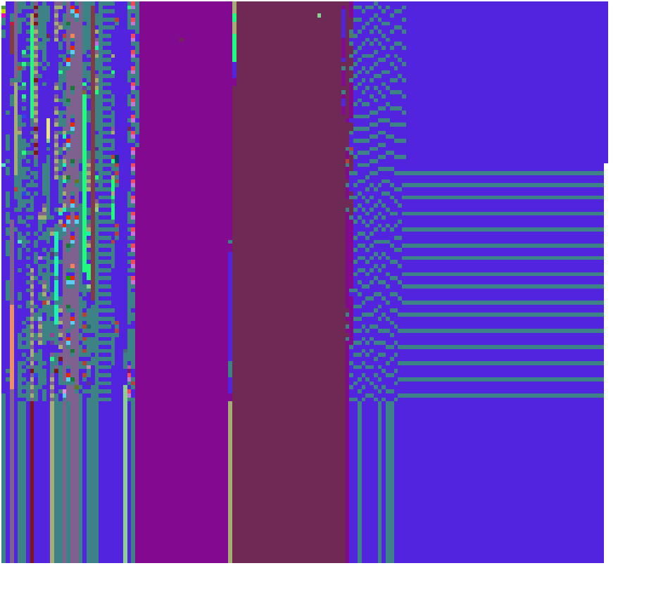

# Screenshots

<table>
<tr>
<td width="50%">

<strong>Inspector on a proxy to a `CompiledMethod`, showing all bytecodes and their `sendAndBranchData`.</strong>

</td>
<td width="50%">

<strong>Inspector on a proxy to a `Morph` from the simulated image, showing a screenshot rendered in the host image.</strong>

</td>
</tr>
</table>

---

<table>
<tr>
<td width="50%">

<strong>Inspector on a proxy to a `CompiledMethod`, showing the address of the OOP in the simulated VM.</strong>

</td>
<td width="50%">

<strong>Inspector on a proxy to a `CompiledMethod`, explaining the header format of the OOP in the simulated VM.</strong>

</td>
</tr>
</table>

---

<table>
<tr>
<td width="50%">

<strong>Inspector on a `CompiledMethod` with a new bytecode assembler mode, allowing to explore and modify single bytecodes of a method.</strong>

</td>
<td width="50%">

&nbsp;

</td>
</tr>
</table>

---

|Interactive visualization of the first 10,000 objects in the object memory and their classes (see [parent readme](../README.md#bonus-using-oopsie-to-visualize-and-explore-the-object-memory))|
|-|
||

---

[Browse all screenshots](.)
